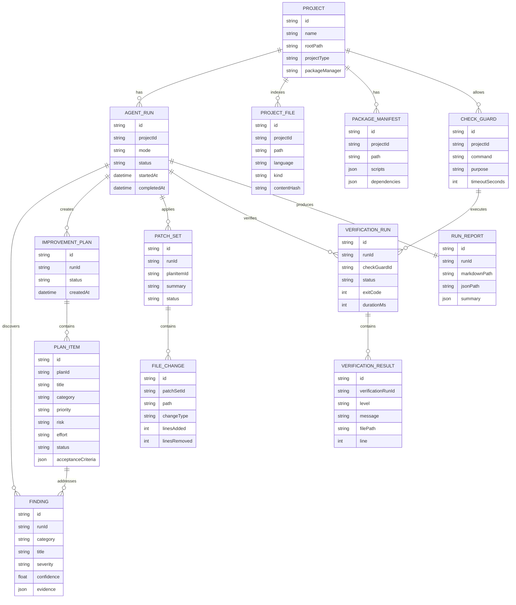

# Pimp My Codebase Agent - TypeScript Plan

## Product Direction

Build a local-first TypeScript CLI agent that improves frontend side projects. The agent should analyze a project, generate an informative Markdown plan/report, optionally apply approved edits from that plan, run project-approved verification commands, and produce a final report.

Primary user: solo developer.

Primary target: frontend TypeScript/Node projects, starting with pnpm and the `../logo` React project.

Primary value: quality modernization, meaningful refactoring, architecture improvement, security hardening, tests, UI polish, and feature-readiness.

## Decisions

| Area            | Decision                                                                              |
| --------------- | ------------------------------------------------------------------------------------- |
| Interface       | CLI-only for v1.                                                                      |
| Workflow        | Two-phase: `plan` first, then `apply` approved plan items.                            |
| Target stack    | Frontend TypeScript/Node projects.                                                    |
| Package manager | pnpm first-class.                                                                     |
| LLM             | Local LM Studio first, configurable per project.                                      |
| Future LLMs     | Use a provider interface for remote providers later.                                  |
| Output          | Markdown report first, JSON artifact for future web app integration.                  |
| Verification    | Run only project allowlisted check guards.                                            |
| Git             | No branch, commit, or PR automation in v1.                                            |
| Risk            | Configurable, but biased toward useful modernization and refactors.                   |
| Style           | Opinionated defaults, configurable through project settings and skill markdown.       |
| Privacy         | Do not read `.env`, secrets, private registry credentials, or git history by default. |
| Done state      | Report generated. In apply mode, report includes patch and verification results.      |

## Core Workflow

```mermaid
flowchart LR
  CLI["CLI"] --> Session["Agent Session"]
  Session --> Scanner["Project Scanner"]
  Scanner --> Inventory["Project Inventory"]
  Inventory --> Analyzer["Analyzer Pipeline"]
  Analyzer --> Planner["Improvement Planner"]
  Planner --> Report["Markdown + JSON Plan"]
  Report --> Approval["User Selects Plan Items"]
  Approval --> Patcher["Patch Engine"]
  Patcher --> Verifier["Check Guards"]
  Verifier --> FinalReport["Final Report"]
```



## ERD



## CLI Commands

```bash
pimp-my-codebase plan --repo .
pimp-my-codebase apply --repo . --plan .pimp-my-codebase/runs/latest/plan.json --items item-1,item-2
pimp-my-codebase verify --repo .
pimp-my-codebase report --repo .
pimp-my-codebase debug --repo . --json
pimp-my-codebase plan --repo . --debug --format json
```

## V1 Scope

Include:

- CLI commands: `plan`, `apply`, `verify`, `report`.
- pnpm project detection.
- frontend TypeScript scanner.
- privacy-safe file inventory.
- local LM Studio provider.
- skill markdown support for improvement styles.
- Markdown report generation.
- JSON run artifact generation.
- check-guard allowlist for verification commands.
- plan-first edit workflow.

Exclude:

- web app UI.
- server database.
- git branch, commit, or PR creation.
- broad backend/multi-language support.
- automatic `.env`, secret, credential, or git history reading.
- non-interactive CI mode.

## Module Plan

| Module         | Responsibility                                                  |
| -------------- | --------------------------------------------------------------- |
| `cli`          | Parse commands, repo path, plan item selection, output options. |
| `core`         | Run lifecycle, events, errors, cancellation.                    |
| `config`       | Load project settings, privacy policy, check guards, skills.    |
| `project`      | Scan files, manifests, package manager, frontend stack.         |
| `llm`          | LM Studio client and future provider interface.                 |
| `analysis`     | Run analyzers and produce findings.                             |
| `planning`     | Rank findings and create plan items.                            |
| `patching`     | Apply approved plan items and track diffs.                      |
| `verification` | Run allowlisted check guards and summarize failures.            |
| `reporting`    | Write Markdown reports and JSON artifacts.                      |
| `persistence`  | Store run artifacts in `.pimp-my-codebase/runs`.                |

## Analyzer Categories

- correctness
- maintainability
- architecture
- modernization
- testing
- security
- performance
- accessibility
- UI polish
- developer experience
- documentation

## Safety Policy

Default deny:

- `.env`, `.env.*`
- `.npmrc`, auth tokens, private registry credentials
- `.git` internals and git history
- generated files unless explicitly allowed
- destructive filesystem commands
- git branch, commit, reset, or push commands

Allowed only through project config:

- verification commands
- generated file reads
- higher-risk refactors
- dependency changes

## Suggested Config

```json
{
  "projectType": "frontend",
  "packageManager": "pnpm",
  "llm": {
    "provider": "lmstudio",
    "baseUrl": "http://localhost:1234/v1",
    "model": "project-configured-model"
  },
  "privacy": {
    "ignore": [".env", ".env.*", ".npmrc", ".git"],
    "readGitHistory": false,
    "readSecrets": false
  },
  "checks": [
    {
      "id": "typecheck",
      "command": "pnpm typecheck",
      "timeoutSeconds": 120
    },
    {
      "id": "lint",
      "command": "pnpm lint",
      "timeoutSeconds": 120
    },
    {
      "id": "test",
      "command": "pnpm test",
      "timeoutSeconds": 180
    },
    {
      "id": "build",
      "command": "pnpm build",
      "timeoutSeconds": 240
    }
  ],
  "skills": ["modernize", "quality", "frontend-polish"]
}
```

## Skill Markdown Shape

Each skill markdown file should define:

- intent
- preferred project signals
- allowed change types
- forbidden change types
- scoring weights
- preferred check guards
- report sections

Example skills:

- `modernize`
- `quality`
- `frontend-polish`
- `security-pass`
- `test-booster`
- `architecture-cleanup`

## Implementation Phases

### Phase 1 - Project Scanner And Reports

- Create TypeScript CLI skeleton.
- Add `plan`, `verify`, and `report`.
- Detect pnpm frontend projects.
- Build privacy-safe inventory.
- Parse `package.json`, lockfile, `tsconfig`, Vite/React/Next/Tailwind/test configs.
- Save Markdown and JSON run artifacts.

Done when the agent can scan `../logo` and produce a useful Markdown plan.

### Phase 2 - Local LLM And Skills

- Add LM Studio provider.
- Add provider interface.
- Add skill markdown loading.
- Use deterministic scanner output as LLM context.
- Generate plan items with evidence, risk, effort, and acceptance criteria.

Done when the agent can generate a better plan using local LLM context without reading forbidden files.

### Phase 3 - Check Guards

- Load allowlisted verification commands.
- Run check guards with timeout and output summaries.
- Attach verification results to reports.

Done when `verify` runs configured pnpm checks and reports pass/fail clearly.

### Phase 4 - Apply Approved Plan Items

- Add `apply` command.
- Select plan items by ID.
- Apply small approved edits.
- Track patch sets and file changes.
- Refuse unsafe or dirty-file edits.

Done when one low-risk improvement can be applied and reported.

### Phase 5 - Stronger Frontend Intelligence

- Add analyzers for accessibility, UI polish, tests, architecture, dependencies, security, and DX.
- Improve ranking and scoring.
- Add before/after scoring if useful.

Done when reports feel valuable for real frontend modernization work.

## First Milestone

Build a minimal CLI that can:

```bash
pimp-my-codebase plan --repo ../logo
pimp-my-codebase verify --repo ../logo
pimp-my-codebase report --repo ../logo
```

Milestone is complete when the agent scans `../logo`, creates `.pimp-my-codebase/runs/<run-id>/report.md`, creates a JSON artifact, and summarizes configured check guards.

## Open Questions

1. Confirm run storage: use Markdown + JSON under `.pimp-my-codebase/runs`?
   Im not sure, use what you recommend
2. Confirm approval style: batch approval from saved plan with selectable item IDs?
   yes batch approvals
3. Confirm opinionated baseline: strict TypeScript, pnpm, ESLint/Prettier, accessibility, tests, clean module boundaries?
   all of that
4. Confirm whether generated files should always be denied unless explicitly allowed.
   what you recommend
